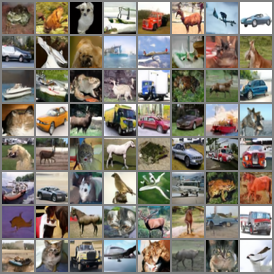

# Introdution

For image generation tasks, the **Denoising Diffusion Probabilistic Model (DDPM)** serves as a fundamental infrastructure model. It has driven the development of high-resolution image generative models like Stable Diffusion and made significant contributions to the field. 

The **DDPM** shares its mathematical foundation with *Variational AutoEncoder (VAE)*. However, unlike VAE, DDPM only requires training the decoder for image generation, eliminating the need for encoder training.

# Training and Sampling Algorithm

- **Training :**
  The thesis author's major contribution is the training algorithm. They transformed complex mathematical statistics into a more practical form where the model predicts noise directly.
  As a result, **DDPM**'s training algorithm enables it to require training only for Decoder .
  
    

- Sampling
  When we aim to synthesize or generate images , the algorithm differs from training process. In DDPM, teh authors assume that the total steps of generation steps is large(e.g. one thousand).   The process involves progressively donoising a sampled vector from a standard normal distrubution , step by step . Eventually , upon completing the denoising process , we obtain a clear image.
  
    

# Metrics for Images generation

- **Fréchet Inception Distance (FID)**:
  The Fréchet Inception Distance (FID) is a widely used metric to evaluate the quality of images generated by generative models. It quantifies the similarity between the feature distributions of real and generated images in a high-dimensional feature space extracted by the inception V3 model. The calculation process is as follows :
1. **Prepare Datasets**:
   Collect two datasets -one containing real images and the other containing images generated by the model.

2. **Feature Extraction**:
   Use the inception V3 model to extract features for each image in both datasets . These features are typically taken from the penultimate layer of the model, which represents high-level semantic information .

3. **Compute Statistics** :
   Calculate the mean vector μ and covariance matrix Σ for the features of each dataset:
   a. $\mu_1,\sigma_1$: Mean vector and covariance matrix for the real dataset.
   b. $\mu_2,\sigma_2:$ Mean vector and covariance matrix for the generated dataset.

4. **Calculate FID**:
   FID=|\mu_1−\mu_2 |+T𝑟(\sigma_1+\sigma_2−2√(\sigma_1∗\sigma_2 ))
   
   A smaller FID indicates that the distribution of generated images is closer to that of real images , suggesting better performance of the generative model.
- **IS (Inception Score)** :
  The Inception Score evaluates two keys aspects : clarity and diversity.
1. **Clarity** :
    When the generated images are fed into the Inception V3 model, the model extracts features and outputs a thousand-dimensional vector. Each dimension of the vector represents the probability of the image belonging to a specific category. For a clear image , the probability of one category should be significantly higher , while the probabilities of other category remain low.
   In technical terms ,the  $p(y|x)$ quantifies the confidence of the image belonging to a certain category, and for clear images, this confidence should be high for one category while remaining low for others.
   
   2.**Diversity** : 
   If the generated images from the mode are sufficiently diverse, the probability distribution across all categories should be uniform. For example, if the model generates 10000 images, the ideal case is that each of the 1000 categories has exactly 10 images . In mathematical terms , this means that the entropy of the marginal distribution P(y) , which represents the probability of each category, is maximized .
   
   
   
   **the completely term is** :
   
   

# Result

# Reference

[[2006.11239] Denoising Diffusion Probabilistic Models](https://arxiv.org/abs/2006.11239)

[[2208.11970] Understanding Diffusion Models: A Unified Perspective](https://arxiv.org/abs/2208.11970)

[GitHub - w86763777/pytorch-ddpm: Unofficial PyTorch implementation of Denoising Diffusion Probabilistic Models](https://github.com/w86763777/pytorch-ddpm/tree/master)